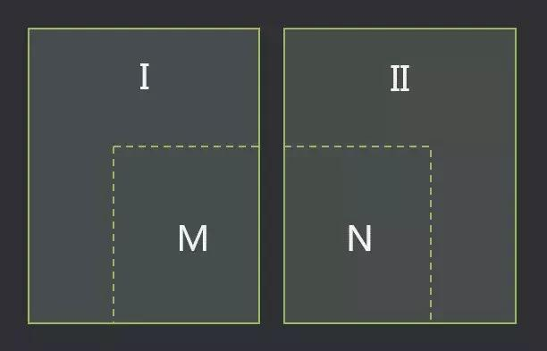
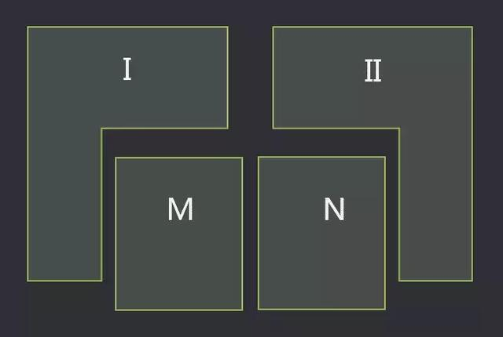
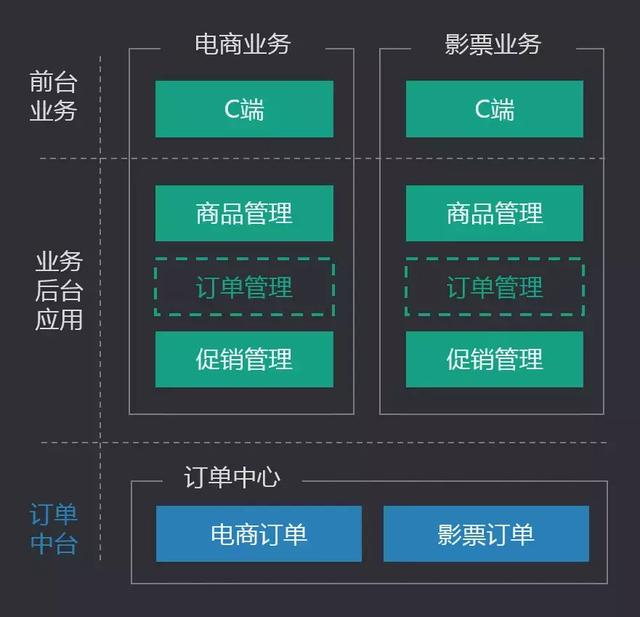
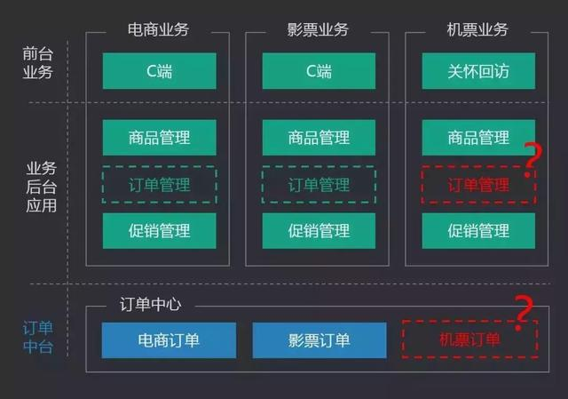
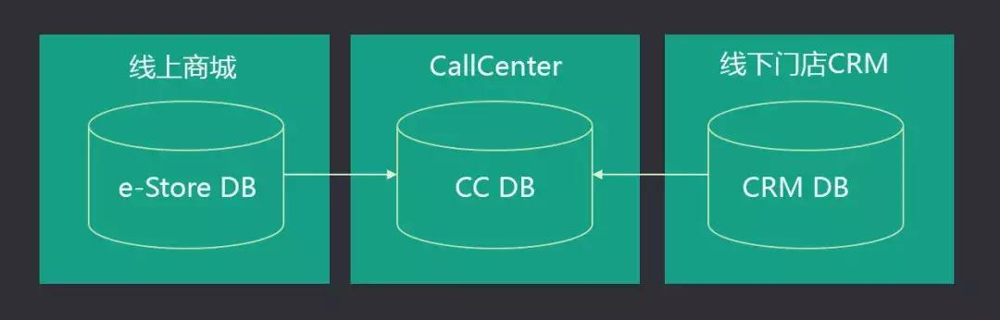
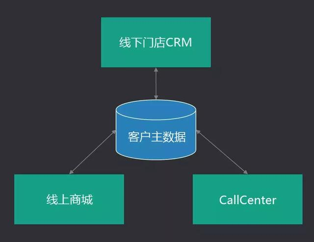
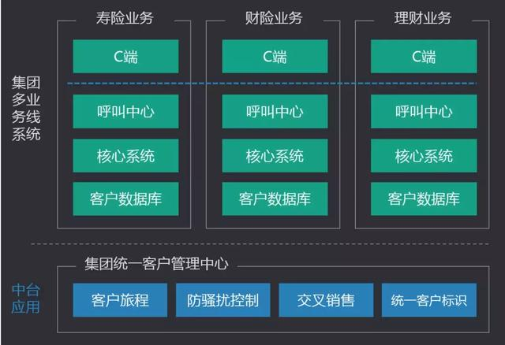

# 换个视角，看中台

转载：https://www.toutiao.com/i6724853577107374605/

中台建设，是近两年非常火热的一个话题，从产品中台，到技术中台，再到组织中台，各种概念、理念，以及方法论被深度的研究、探讨。

对于互联网产品领域来讲，中台更多的是2B产品建设中涉及的课题，因为软件系统的抽象复用，更多的是做复杂B端系统建设中面临的问题。

因此，中台产品设计，是所有B端产品经理应该深度关注的课题。

针对B端产品设计领域，中台产品到底该如何设计？有何特点？设计的本质是什么？有何挑战？本文将从全新的视角，重新审视中台产品建设，让您更加深刻地理解中台产品设计精要。

**经典视角下的中台建设**

首先，我们有必要回顾下经典的中台建设视角。

一般来讲，行业内往往从组织中台、产品中台、数据中台、技术中台这四个主题切入并探讨中台建设。

**1. 组织中台**

组织中台研究的是企业内部的组织结构设计，如何通过合理的权责划分，以及管理架构搭建，提高业务部门的经营能力，迅速响应市场变化，并且能够让企业提升整体跨部门跨业务线协作效率，降低运营成本，实现标准化管理。

所谓组织中台的设计思路，实际上已经存在了很多年了，在集团企业中，往往采取事业部制的组织形态，再配合各种共享服务中心的建设，实现前后端业务分离，前端业务保持机动性，后端业务提供火力支援。

类似于财务共享服务中心FSSC（Financial Shared Service Center），人力资源共享服务中心HRSSC（Human Rersources Shared Service Center），其实就是典型的中台管理思路下的组织形态和职能部门建设的方法。如下图：

一个常见的事业部制的组织机构图

**2. 产品中台**

产品中台研究的是企业内部的软件系统如何进行抽象和设计，从而让企业的软件系统就像搭建积木一样灵活，可以重复高效利用现成的软件组件，快速组装开发出新的软件系统，从而节约软件开发成本，并能够快速支持新业务开展。

——很多文章也把这类中台产品称作业务中台，或业务中台产品。

目前被广泛讨论的产品中台包括电商交易中台、账号中心中台等，其中电商交易线又被更加广泛的探讨，包括了订单中台、支付中台、商品中台、促销中台等。

产品中台还有另一层含义，即能够给全公司全企业提供一致服务的管理软件产品，也可以纳入产品中台的范畴，例如呼叫中心、项目管理软件。

从某种程度上来讲，这些标准化软件产品也是中台产品。

**3. 数据中台**

数据中台研究的是企业内部的数据管理、治理问题，以及数据产品体系和数据底层结构的搭建问题。

数据中台研究的范畴，包括企业统一的数据安全、数据规范、元数据管理、数据编码管理，以及数据仓库、数据集市的拓扑架构，也包括大数据底层和运算能力建设和复用。

要注意的是：数据中台更多的关心从业务和产品层面对数据的治理、管理、应用，而非技术层面问题。

**4. 技术中台**

技术中台研究的是软件产品的技术实现过程中，哪些技术上的处理能力和架构可以进行抽象复用，例如消息中间件MQ，分布式计算框架Hadoop，分布式服务框架HSF，各种Open API等等。

技术中台是纯粹从技术实现底层来思考基础服务和基础模块的复用能力，其设计思路和产品中台一脉相承，是技术人员需要深度思考的问题。

以上四个主题，涵盖了互联网模式下对于企业中台建设的所有课题范围；其中，对于产品经理来讲，工作相关性最强，最需要关注的是产品中台和数据中台。

实际上，上述四个主题，也正是传统企业信息化建设中非常核心的企业架构EA（Enterprise Architecture）理论对企业业务管理的IT视角下的切分。

其中：

- 组织中台对应EA中研究的企业业务架构EBA（Enterprise Business Architecture）中的组织架构治理部分；
- 产品中台对应EA中研究企业应用架构的EAA（Enterprise Application Architecture）；
- 数据中台对应EA中研究企业数据架构的EDA（Enterprise Data Architecture）；
- 技术中台对应EA中研究企业技术架构的ETA（Enterprise Technology Artchitecture）。

关于EA的论述，可能让很多纯互联网背景的同学读起来很困惑，但实际上，互联网企业所谓的中台建设思路，逃不出经过几十年沉淀的信息技术理论框架，以及管理理论框架。

而传统信息技术理论，在互联网企业的B端产品建设中具有极强的参考、借鉴价值。

然而，我们今天讨论的主题，还不是研究企业架构EA对中台建设的指导，而是尝试从更加深层次的角度，去探索产品中台、数据中台的设计本质——尤其是对于B端产品经理来讲非常核心的产品中台的设计精要。

对于产品中台，目前公认的关键要点包括如下关键词：

**企业级、抽象、下沉、复用**

这些关键词代表了产品中台建设的特点，同时也是在企业应用架构设计中需要深层次思考的问题。

（所谓企业应用架构，是指企业内部的各个软件系统，应该以什么样的形式建设、组合，从而高效的支持企业的经营运作）

因此，如果要深层次的思考软件产品的企业级抽象、下沉、复用问题，可以从以下三个角度进行全新的审视。分别是：

1. 基于抽象复用的视角；
2. 基于架构合理性的视角；
3. 基于业务统一管理的视角。

我们通过从这三个视角切入，可以全面的解构中台产品设计的要义，并且可以更加全面的穷举中台建设的方法论、要点和难点。

**基于抽象复用的视角建设中台**

**1. 建设的目的**

所谓抽象复用，是指对软件中重复的功能和模块进行抽象并下沉一层。

什么叫抽象？什么叫下沉？

我们举例说明：

如下图，有两个系统I和II，其中系统I中具有模块M，系统II中具有模块N，经过分析发现，模块M和N的功能高度类似重复，完全可以抽象合并，避免重复建设。

识别共性模块

现决定将模块M和N分别从系统I和II中剥离出来，如下图：

抽离共性模块

将M和N剥离出来后，我们对其功能进行抽象合并，如下图。

M和N合并后，得到模块A + B + C，其中A是M和N中共有的功能，B和C分别是针对系统I和II提供的一些定制化功能。

虽然有少量功能无法做到完全合并和复用，但新模块中绝大多数功能集合A已经被高度抽象，可以被系统I和II复用；而被剥离合并后的全新模块A+B+C，将会下沉一层，作为基础服务，为系统I和II提供支持。如下图：

合并共性模块

以上案例，演示了系统功能如何被合并、抽象、下沉，这种设计思路，节约了软件研发成本，是一种非常经典的中台设计思路。

接下来，我们通过一个实践案例，进一步演示这种设计思路。

**2. 案例：统一客户视图建设**

**1）案例背景**

某流量型互联网公司，变现模式主要为针对中小企业的广告售卖，业务团队包括电话销售团队（IS，Inbound Sales），外勤线下销售团队（OS，Outbound Sales），以及客服团队。

三个业务团队有着各自独立的业务系统支持其运转，每个业务系统中既有个性化功能，例如针对IS的外呼管理、针对OS的拜访管理、针对客服的关怀回访；也有功能高度类似的重复功能，例如客户管理列表，客户详情页。

系统架构图如下图所示：

重复的客户详情页建设

**2）遇到的问题**

三套业务系统各自有产品研发团队维护，系统早期为了快速支持业务从而分别建设，快速响应业务诉求，为业务发展立下了汗马功劳。

但随着系统的逐步成熟，其中一些问题也逐渐凸显，首要问题就是功能重复开发建设问题。

虽然三个业务部门对客户关注的侧重点不同，但基本诉求是一致的：希望能看到客户所有的重要信息；因此，三个系统的客户详情页功能已经高度类似，而每次针对客户资料的调整变化，需要三个研发团队分别重复开发三遍，非常浪费人力资源。

**3）解决方案**

为了解决三套业务系统中高度类似的客户详情页的重复开发问题，也为了给业务人员提供一致的、准确的客户视图，公司决定将客户详情页模块从三个业务系统中剥离，将功能合并后，建设“统一客户视图（ECIF）”模块，该模块拥有一致的客户数据底层，并提供完整的客户信息查询服务化接口，以及可以嵌入业务系统直接使用的客户详情页面组件。

“统一客户视图”将作为中台产品，为各个业务系统提供企业客户数据查询的服务以及视图。如下图：

将客户详情页抽象下沉建设统一客户视图中台

任何业务系统，既可以调用该模块的成熟接口查询客户数据并自己设计前端页面，也可以直接嵌入“统一客户视图”提供的现成的客户详情页组件，并且该页面组件还可以进行灵活的权限配置，定义针对不同的业务系统、不同用户角色的数据查看、编辑范围。

由此，我们完成了对客户详情页的抽象下沉，三套曾经重复开发的页面被合并成了一套，以后研发团队只需要维护这一套页面，研发人力得到了释放。

这就是典型的基于抽象复用的视角设计的中台产品。这种模式有一个显著特点，即软件的抽象和复用是成本问题，不影响业务。案例中，虽然有三套客户详情页被重复建设，但只是个资源浪费问题，并不会影响到业务的开展。

**3. 面临的挑战**

对软件功能模块进行抽象复用，是具有很强挑战性的工作；如果分析不当或经验不足，有可能做出错误的抽象方案。

我们总是希望能够对软件和功能进行正确的抽象决策，让抽象出的系统和模块具有高度重叠的特性，例如下图这样：

期望的抽象结果

然而，受限于经验不足，或掌握的信息不足，很可能做出错误的判断和设计，做出了错误的抽象决策，最后被抽象的系统模块，并不能被充分复用，只是制造了一个畸形的别扭的模块，生硬的把一堆毫无关联的功能强行捏在一起，给研发工作反而带来的更大的麻烦，如下图：

错误的抽象结果

我们将通过实际案例，给大家演示这种设计错误。

**4. 案例：订单中心的建设**

**1）案例背景**

某互联网公司同时开展了电商业务和电影票业务。每条业务线都有独立的C端系统、后台交易系统（包括商品管理、订单管理、促销管理）来支持业务。

为了追逐潮流，公司决定将两条业务线的订单中心合并，实现订单中台，如下图：

并不一定正确的订单中台

**2）错误的决策**

实际上，公司经营的B2C电商业务和影票业务，在交易形态上有较大区别；尤其体现在订单模块的设计上，订单的状态机、数据模型和财务账务处理模式完全不同，强行将两者合并后，并没有太多的共性模块和功能，最终只是表面上看起来实现了订单中台，但是里边的功能模块各自独立，各自运转，完全没有抽象和复用。

**3）扩展难题**

现在，公司管理者以为拥有了强大的“订单中台”，可以为任何新业务的快速开展提供支持。

很快，公司决定开展机票售卖业务，针对机票业务，有独立的C端，商品管理，促销管理。

但是当产品经理和工程师开始期待订单中台的强大能力时，遗憾地发现：

订单中台无法给机票业务提供任何现成的功能复用能力，机票的订单模型和电商以及影票都不相同。

机票业务线的设计人员面临一个尴尬的局面：

- 要么“政治正确”的将机票订单中心纳入订单中台统一建设——但实际上这会严重降低开发效率，因为中台研发团队肯定不会像机票业务自己的研发团队那样重视新业务的开展；
- 要么就抛弃订单中台，自己独立开发订单模块，但这样做又会显得订单中台没有产生该有的价值。

如果你是机票业务的负责人，该怎么权衡取舍呢？

此时的系统架构如下图：

订单中台并不能很好的支持机票业务

可见，订单中心，在不同业务模式下，并不一定适用于中台化建设，设计人员要有足够的思辨能力，判断产品形态上是否值得抽象下沉，是否能够提供复用能力。

然而，这也是软件工程设计中非常难的部分。

任何软件系统的设计，都是基于归纳法，而非演绎法，即软件设计人员总是通过对现有世界和业务的总结提炼，完成软件设计，而无法通过推测演绎，完成软件设计。

设计人员无法对业务的未来做出预测，只能基于有限的经验，尽量的保证设计的灵活性和正确性。

理解这一点非常重要，这会让你在软件设计、产品设计时心存敬畏之心，不会一味地追求短期无法论证的结论而产生的严重的过度设计。

**5. 实践中的建议**

以下是基于抽象复用的视角建设中台的几条建议：

**1）明显具备共性的模块尽早抽象**

B端产品的体系化设计中，很多形态的产品是具备明显共性的，可以尽早的进行抽象设计，这样在系统架构建设的早期，就能做出正确的设计方案，而且并不会增加多少研发工作量，但会让未来的系统扩展更加轻松。

例如，业务系统的统一权限管理系统、单点登录系统、组织架构系统、公告系统、短信系统，这些系统都应该尽早抽象建设。

**2）不确定共性的模块事后抽象**

例如统一客户视图、订单中心、商品系统，这些软件模块，很难判断在多业务线场景下能够完全复用；如果对于是否抽象拿不准主意，完全可以先不做抽象，等业务渐渐明确后，有足够的信息作出充分的分析和判断，再决定是否合并抽象。

**3）避免人力外包中台**

中台的建设一定要有合理的原因，如果只是为了中台而中台，会让系统的架构混乱，工作效率反而降低，而且很容易产生“人力外包中台”现象——即下游业务团队把中台团队当做乙方来合作，“反正你们要帮我们打理好这些模块，不管是否合理，需求提交给你就必须得高优支持，否则就是不支持业务一线”，这样会让中台产品和中台团队失去该有的气质，形成团队间的敌意和隔阂。

**基于架构合理性的视角建设中台**

**1. 建设的目的**

软件的应用架构设计，不是随意任性的系统、模块组合，而是有着深刻的设计方法论与合理性诉求。

为了满足应用架构合理性的要求，很多时候需要将软件抽象并下沉一层。

所谓应用架构合理性，是为了避免因为应用架构设计的不合理，而造成业务问题。

企业中软件系统的建设，很容易出现两个常见问题：一个叫做烟囱应用，一个叫做数据孤岛。

企业内部的软件系统，很多都是为了某个独立的业务部门而设计研发，例如CRM，WMS，OA——这些系统设计初衷是支持业务部门的独立运作，而企业内部跨部门的业务流程和数据传递是无处不在的。

如果业务系统没有做很好的架构设计或服务化处理，那么系统之间就无法通信交流，业务流程就会被割裂，每一个应用系统就像一根根烟囱一样，互无联系，这就是“烟囱应用”——烟囱应用会造成部门墙，让企业的业务无法顺畅流转运作。

烟囱应用

因为烟囱应用的存在，每个应用系统生产的数据会更加孤立；系统之间数据没有关联，没有打通，系统之间的数据就像一座座孤岛，彼此独立；数据的价值被严重弱化，数据孤岛会造成严重的业务问题。

数据孤岛

接下来的案例，会演示数据孤岛问题，以及如何通过中台化的架构设计思路解决该问题。

**2. 案例：客户主数据的建设**

**1）案例背景**

某公司开展了线下零售店和线上商城两条业务线，由于这两条业务线开展之初是独立经营建设管理，因此系统建设也是由两个产研团队分别负责，这就造成了线上和线下业务分别有一套客户数据库。

现在公司设立了独立的客服一级部门同时服务于线上线下业务，而客服人员使用的客服业务系统，是不能同时访问两套客户数据库的，因此只能将两套客户数据库冗余成一套针对客服业务系统使用的客户数据库。

此时，公司内部一共有三套客户数据库，各自像孤岛一样存在。

如下图所示：

客户数据存在孤岛

**2）遇到的问题**

显然，上述应用架构存在严重的数据孤岛问题，并且会产生严重的业务问题。

具体如下：

- 线上客户如果想体验线下服务需要重新注册会员，客户体验极差
- 线下客户如果想体验线上业务需要重新注册账号，客户体验极差
- 线上线下客户数据重复，无法识别唯一性
- 呈现给客服人员的客户数据是同步后的具有滞后性
- 客服无法准确识别客户信息并帮助客户修改资料
- 企业无法做线上线下客户消费的关联性分析，无法做交叉销售

**3）解决方案**

因为应用架构设计的不合理，导致业务受到严重影响，客户体验差。

如何解决多个业务系统中存在的数据孤岛问题呢？

实际上解决办法也很简单：就是将客户数据库合并后只保留唯一的一份客户数据资料，所有下游业务系统都访问这个唯一的客户数据库，进行客户数据的增删改查操作。

此时，系统之间的拓扑结构发生了改变，新的应用架构图如下图：

通过主数据设计思路解决孤岛问题

这种针对企业的核心的、相对稳定不容易变化的、被充分共享的数据，叫做主数据MDM（Master Data Management），通过主数据的设计思路，可以很好地解决烟囱应用和数据孤岛问题，尤其是数据孤岛问题。

主数据作为一种基础服务，正是一种中台化的治理理念。

企业内常见的主数据包括客户主数据、供应商主数据、组织机构主数据、商品主数据等等。

你可能之前没有听到过主数据的概念，但仔细想想，实际上主数据在B端产品的架构设计中时刻存在。

基于应用架构合理性的视角来构建中台，这种模式的特点，是**软件的抽象和架构设计会影响业务**，这和基于抽象复用的视角构建中台有着显著地区别：

- 前者如果不做抽象和下沉，会造成很多业务问题，例如案例中提到的客户管理问题；
- 后者如果不做抽象和下沉，只是成本问题，不影响业务，例如之前统一客户视图的案例，虽然开发资源浪费，但系统的问题并不会影响业务开展。

**3. 面临的挑战**

有时候，对于企业来讲，正确的架构并不一定是合理的选择，反而错误的架构可能更有益于业务发展。

理想化的架构设计，可能反而会拖慢业务节奏。

这是架构设计中经常面临的问题，我们通过一个案例来进行阐述。

**4. 案例：账号中心的建设**

**1）背景**

某互联网公司起家于短视频业务，业务发展良好，市场占有率高，短视频产品功能形态丰富。

公司基于各方面考虑，决定同时开展理财业务，希望在火爆的P2P市场中狂欢一场。

公司的短视频业务的账号中心，建设初期就采用了服务化的思路，因此很好的和短视频前台业务的C端APP实现了解耦合，实际上已经实现了中台化的建设部署。

面对新开展的理财业务，产研负责人决定复用一套账号中心（Passport），从而发挥中台产品优势，为新业务赋能。

理财业务的产品技术体系是独立的，虽然想完全独立研发所有的前后端系统，但是迫于压力，不敢违背公司搞大中台、小前台的指导思想，决定复用基于短视频业务构建的账号中心中台来开展业务。

整个架构图如下图：

理财业务复用了短视频业务的账号中心中台

**2）遇到的问题**

账号中心作为中台产品，除了为短视频业务提供服务，还能快速赋能新业务，支持理财业务开展业务；理财业务只需要建设对应的APP C端和简单的管理后台，对于比较复杂的账号中心，完全不用浪费人力从头开发。

看起来，完美的架构发挥了优势，支持了业务。

产研负责人很开心：中台理念得到了落地，在老板面前有面子。

然而，事实真的如此么？

理财业务开展过程之中，需要针对账号中心做较多的个性化功能定制，例如需要实线账号的信用认证管理，地址管理，银行卡管理等等，相对于短视频业务的账号中心，理财业务对账号中心的功能要求、安全性要求、风控要求更高。

理财团队给账号中心提交了一堆需求，但是账号中心的响应速度非常缓慢，因为两个团队不是一个产研体系，也没有管理关系，账号中台团队总是将理财业务的需求优先级调到最低。

因为账号中台的响应速度慢，理财业务负责人多次找老板沟通协调，但公司对待理财业务的态度又变的有些暧昧，并没有保持最强有力的支持，这下就比较尴尬了：

——理财业务虽然有自己的研发团队，但是账号中心用的却是中台的，而中台团队又不是很支持理财业务（按照中台团队的说法，理财业务提交的需求个性化太强，工作量巨大，对短视频业务一点价值都没有，投入产出比低，优先级低），导致业务进展缓慢，不能很好地支持客户需求和业务发展诉求，浪费了宝贵的竞争时间，只能眼睁睁的看着对手攻城略地，越走越远。

可见，设计了正确的中台产品，以及保证了架构的合理性，在某些情况下，反而会影响到业务的快速发展。

**5. 实践中的建议**

架构设计的核心目标是支持业务发展，某些时候可以允许不合理的架构存在。

在Passport的案例中，理财业务实际上是按照独立公司、独立品牌运作的，包括产品研发团队都是独立的。

作为一个不确定性高、市场变化迅速的创新业务，极有可能运作半年后项目就中止了，这时候业务上更希望保持快速的响应和落地能力，而不是考虑软件架构是否合理，即便理财业务独立开发了Passport，即便理财业务发展成功、最后又需要将两套Passport合并，即便两套Passport合并非常麻烦，成本高，但是，至少业务通过快速响应，迅速切入市场，取得了成功。

而且，有些时候，所谓的中台化改造，架构合理性设计，会严重影响到原有系统和业务的稳定性。

例如，假设新开展的B2B业务，要复用B2C业务的订单中心，将B2C业务的订单中心实现中台化改造，那么问题来了，B2C业务作为公司的核心主营业务，承担了每日十几万的订单交易量，营收占公司整体营收的95%。

而B2B业务作为创新实验项目，预计每个月只能带来几十万的GMV，并且，如果要将B2C的订单中心中台化，兼容B2B业务，要承担非常高的系统改造风险。

那么，问题来了：有必要为了架构合理的中台化建设，而承担高风险（甚至有可能把主营业务的核心B2C订单系统干趴下），去支持小体量的创新业务么？

产品设计人员、架构师、产研负责人，在面临这些问题时，必须谨慎思考，基于对业务、市场、系统、代码、架构、人员、团队，各方面进行综合判断后，做出决策，即便有时候做出的决策在系统架构上看起来是错误的，但对于公司和业务的长远利益来讲上是正确的。

**基于业务统一管理的视角建设中台**

**1. 建设的目的**

企业发展到一定阶段后，往往会出现集中化管理的诉求，对之前各自独立的子公司、事业部，在某些方面实现集中化的管理控制，一方面为了加强集团管控能力，另一方面也是因为业务协同经营需要。

如果想实现这类业务诉求，就必须通过对软件的下沉和抽象，来实现业务的集中化管控。

下边，我们来通过案例进行说明：

**2. 案例：集团多业务线的统一客户销售管控**

**1）案例背景**

某保险集团经过多年发展，实现了寿险、财险、理财稳定的业务三角。三条业务线分别由独立的全资控股子公司经营，三家公司的所有业务系统，从C端到B端，也全部独立建设，互无交集。

简化版的系统架构如下图：

某集团三条业务线下的系统架构

**2）业务诉求**

三家公司独立经营，保持了充分的灵活性，能够快速响应市场变化，取得了成功。但是，随着经营的深入，有一些问题也逐步暴露，并且变得越来越严重，总部高度关注，需要尽快解决，典型问题如下：

- 三家公司经常出现重复采购流量的现象，浪费集团营销成本；
- 三家公司往往对同一个客户重复营销，造成客户投诉；
- 客户价值不能充分挖掘，跨业务线的交叉销售和向上销售做的不好；

现在，集团下定决心解决这些问题，而解决这些问题，必须通过软件产品的中台化建设来实现。

解决方案针对集团面临的三点问题，解决方案如下：

\1. 建立集团的**统一客户标识数据库**（作为集团统一客户管理中心的核心模块来建设），从集团层面识别客户唯一性，确保各个业务线采买流量时能够正确过滤已有客户，节约成本。

\2. 具备客户唯一性识别的能力后，可以实现**集团层面的统一客户营销管理**、客户旅程管理、以及防骚扰控制。通过统一客户管理中心实现客户旅程模块、防骚扰控制模块，将控制策略插入到各个子公司的销售系统中，确保各个子公司的销售触达任务开始之前首先要经过集团层面的控制中心的校验和管理，从而确保同一客户不会同时被几条业务线的销售重复骚扰。

\3. 统一客户管理中心还可以实现**交叉销售模块**，针对某些业务场景下的客户数据，进行跨业务线的销售任务分发，例如识别某寿险客户经济实力较好，则将客户推送到理财业务的销售系统，尝试二次销售转化。

整个系统架构如下图：

通过集团统一客户管理中心实现跨业务线的客户销售管控

综上可见：集团层面，如果想对各个子公司的客户资料、客户营销、客户触达进行统一管理，就必须建立统一客户管理中心，首先实现客户唯一性标识，其次基于客户唯一性标识落地各种统一客户管理策略。

集团统一客户管理中心，正是中台设计思路的实践应用；而集中化的业务管理诉求，则必须通过软件的抽象和架构设计来实现——这也是这种中台建设模式的特点。

**3. 面临的挑战**

业务集中管控的策略，总是滞后的，这是因为业务开展很长的一段时间中，各个业务线独立运作，相安无事，即便有一些小问题，也是可以容忍的，或无关紧要的。

但是当企业规模增长到一定阶段，业务线之间的管理问题会越来越突出，之间的协同问题也会越来越明显，此时就有必要进行集中化的管理和控制。

滞后的业务管理决策，会对系统建设带来较大的挑战，因为各个业务线、事业部、子公司的系统已经发展的非常成熟，针对成熟的系统，去调整架构，改变系统和业务的逻辑，置入新的外部逻辑，是一件很有挑战的事情。

针对未来可能的集中管控诉求，是否能够在系统架构上提前布局，做好结构性的设计，以便未来的某一天，业务需求发生时，能够顺畅、轻松的进行支持么？

实际上这也是不现实的——因为业务上的需求是一个未知数，没必要对未知的需求做架构上的过度设计。

总之，集中化的业务管理诉求总是滞后的，这会给系统、中台的设计和实现带来挑战。设计人员要对这个问题有清晰地认知。

**4. 实践中的建议**

针对业务集中管控诉求下的中台建设，有以下建议：

**1）不要过多考虑未来不一定发生的事情**

集中管控是不一定发生的需求，产品设计初期和中期，没有必要为未来不确定的事情提前做过多的布局——因为很有可能未来根本用不到，却会产生过度设计，造成开发资源的浪费，甚至也会让系统架构看起来非常奇怪。

例如，案例中的集团客户管理中心，在寿险、财险发展初期和中期，有必要在系统上做出这样复杂的架构设计么？在各自独立经营的子公司推进这种架构的落地，如果没有明确的收益和价值，难度和成本巨大。

**2）通过业务价值和业务诉求驱动系统迭代抽象**

没有明确的收益和价值，却采用了这种集中控制调度的软件架构设计，这会让各个事业部的核心销售系统被割裂，被控制，被牵制，恐怕各个事业部是不会愿意配合这种项目的。

即便这种架构很合理，在可预期的未来一定是必须的，但是在当前阶段下却没有任何价值，还会影响各个事业部各自的工作。

没有业务价值和业务诉求的系统迭代抽象工作，是很难推动落地的。

**3）项目必须有高管介入确保推进**

即便业务上已经有明确的诉求，公司决定了执行架构调整，实现集中管控，项目的推进，依然会阻力重重，因为这种调整首先会打破原有的利益格局，也会造成工作习惯的巨大改变。

这类集中管控的项目，如果想成功落地，必须有集团层面的，超越了各个下游业务线的非常高级别的管理人员牵头挂帅，管理团队必须有统一的认识，通过强有力的项目管理手段，才能保证在项目执行过程中化解任何困难，成功落地。

**三种视角下中台建设模式的总结**

我们已经分别介绍了基于抽象复用的视角、基于架构合理性的视角、基于业务统一管理的视角，这三种视角下的中台建设模式，以及每种模式的建设目的、建设特点、面临的挑战。

汇总后得到下表：

这三种视角（或叫三种模式），从左到右，业务属性从弱到强。

即最左侧的抽象复用的视角，纯粹是成本问题，和业务关系不大；中间的架构合理性的视角，具备了一定的业务含义和业务价值；最右侧的业务统一管理的视角，则完全是个业务问题了。

任何系统的中台化建设，都可以从这三个视角中找到影子，要么是基于其中的某个视角建设，要么是基于其中的某两个视角来建设。

例如，统一客户视图、报表引擎，这类产品纯粹是成本问题，遵循着抽象复用视角下的中台建设特点。

主数据、账号中心、数据集市，这类产品兼具了架构问题和业务问题，遵循着后两种视角下的中台建设特点；而防骚扰、大积分体系（即集团多套积分体系的打通和汇兑中心），则纯粹是基于业务出发而建设的产品中台，遵循着业务统一管理视角下的中台建设特点。

在很多情况下，中台产品兼具了多种属性，例如，订单中心、账号中心、组织机构管理、权限管理，这些中台产品，既是研发成本问题，也是架构问题，同时还会影响业务。再例如，支付、清结算、促销重心、商品中心等中台产品，则既是为了解决业务问题，也是为了解决架构问题，同时也可能还解决了成本问题。

总之，上述三种中台建设的视角，在一定程度上穷举了产品中台（即产品经理关注的软件产品的中台化，也就是媒体上常说的业务中台）建设中的所有出发点和可能性。

作者：杨堃 VIPKID产品总监，决胜B端作者，曾任百度高级产品经理，曾从无到有建设多款企业级业务产品